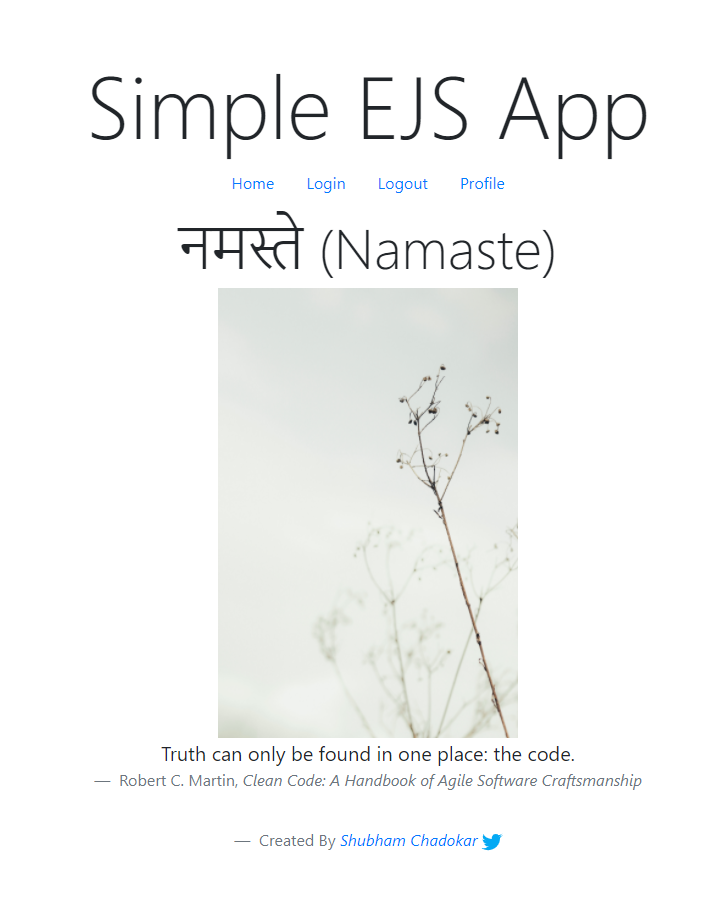

# Simple EJS App

This is a simple app which has home, login, profile and logout routes.

The backend is in nodejs and expressjs.

The frontend is in ejs template engine.

This project is scaffolding project which can be used as a template.

## About me

I am Shubham Chadokar and you can check my work [@schadokar](https://schadokar.dev).

[GitHub Readme](https://github.com/schadokar)

---

Photo by <a href="https://unsplash.com/@babybluecat?utm_source=unsplash&amp;utm_medium=referral&amp;utm_content=creditCopyText">J Lee</a> on <a href="https://unsplash.com/s/photos/simplicity?utm_source=unsplash&amp;utm_medium=referral&amp;utm_content=creditCopyText">Unsplash</a>

---
